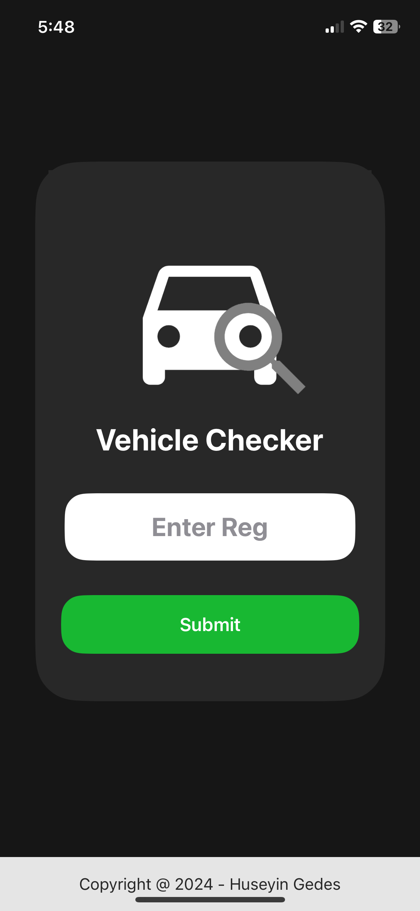
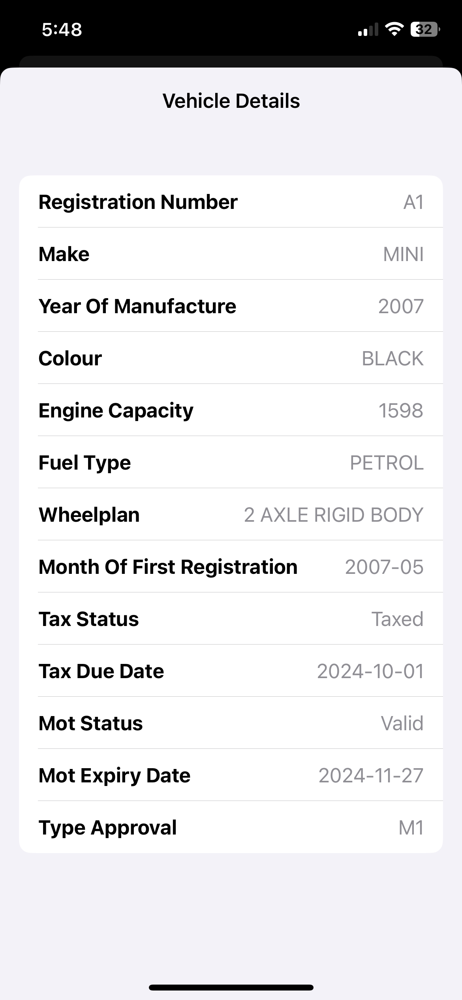

# Vehicle Checker

This is a Vehicle Checker IOS Application built with Xcode, SwiftUI.
It uses the UK Government VES API to retrieve and display data from inputted reg plates.

To use this, you must enter your API Key in the main ContentView.swift File.

    
    

